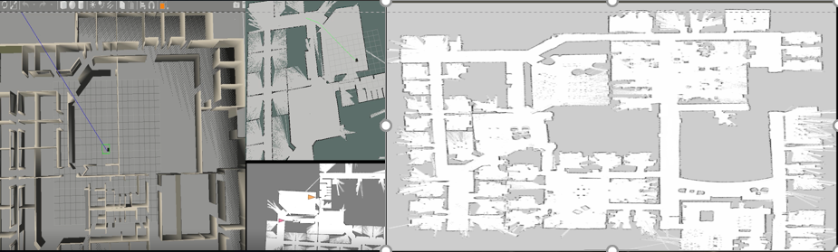

# rosbridge

**项目描述**

​	使用springboot搭建的ROS机器小车控制网页平台

```
一、启动rosbridge项目
```

```
二、启动ROS相关(gazebo,rviz,节点)
```

```
三、运行命令：rosrun robot_pose_publisher robot_pose_publisher、roslaunch rosbridge_server rosbridge_tcp.launch、roslaunch rosbridge_server rosbridge_websocket1.launch
```

```
四、连接并控制机器人
```



**视频地址**：https://www.bilibili.com/video/BV1HK4y197uG/

